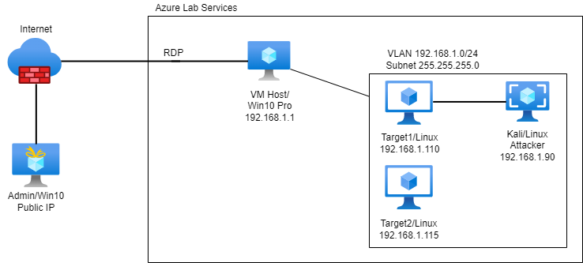

# Project3-OffSec-Final
Attack, Defense &amp; Analysis of a Vulnerable Network

## Cloud Virtualization: Dream Within A Dream Within A Dream

The files in this repository were produced by the network depicted below.

### Contents of Presentation
- Use of NMAP to expose network IPs and vulnerable ports
- Launch a brute force attack in Kali Linux using Hydra (password cracker with wordlist)
- Craft a malicious executable with Msfvenom and attack the target using Metasploit (Meterpreter session)
- Identify components of the attack using a SIEM (Kibana Reporting)
- Propose alerts and hardening strategies to respond to potential future attacks

### Feature Presentation 

Access and download the main [Powerpoint](https://github.com/isejy07/Project2-Red-Blue/tree/main/Presentation/Proj2-RedVBlue.pptx) file for review.

### Supporting Documents 

Access additional materials [here](https://github.com/isejy07/Project3-OffSec-Final/tree/main/Documentation)
